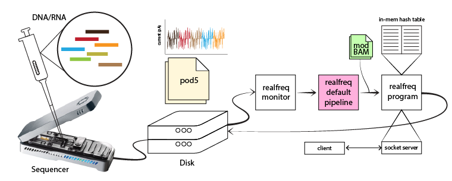
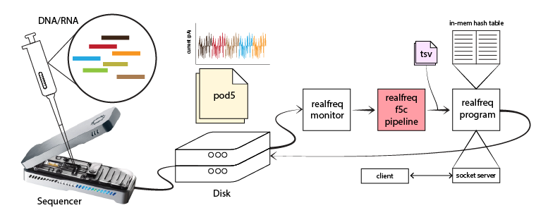

# <em>realfreq</em>
Real-time base modification frequency monitoring tool along with a real-time modification calling pipeline.



# Installation
## Pre-requisites
```bash
sudo apt-get install zlib1g-dev  # install zlib development libraries
```
## Building from source

```bash
git clone https://github.com/imsuneth/realfreq
cd realfreq
./scripts/install-hts.sh
make
```

Append parent directory where binary <em>realfreq</em> is in to PATH variable by appending following line to the <em>~/.bashrc</em> file.
```bash
export PATH=$PATH:/parent/dir/of/realfreq
```
Make sure to run ```source ~/.bashrc``` in order to use <em>realfreq</em> on already opened terminals.

# Usages
### Prerequisits
Following tools should be installed and available as they are used inside the pipeline
- [blue-crab](https://github.com/Psy-Fer/blue-crab)
- [buttery-eel](https://github.com/Psy-Fer/buttery-eel)
- [samtools](https://www.htslib.org/download/)
- [minimap2](https://github.com/lh3/minimap2)

If prerequisits are availbale, execute the following command on a terminal.

## Sample Usecases
### Running the default realfreq-pipeline
As shown in the figure below, realfreq-monitor monitors POD5 files generated by the sequencer. The default realfreq-pipeline (pink block in the figure) processes those POD5 files to generate modBAM files.  Realfreq-program calculates the modification frequencies.


```bash
export DORADO_BIN=/ont-dorado-server/bin
export REF=/genome/hg38noAlt.fa
export REFIDX=/genome/hg38noAlt.idx
export DORADO_MODEL="dna_r10.4.1_e8.2_400bps_5khz_modbases_5hmc_5mc_cg_hac.cfg"

./scripts/realfreq.sh -m /data/exp_id
```

### Running a custom modification calling pipeline
As shown in the figure below, realfreq-monitor monitors POD5 files generated by the sequencer. The realfreq-f5c-pipeline (light red block in the figure) processes those POD5 files to generate TSV files that output f5c methylation calling.  Realfreq-program calculates the modification frequencies. The --tsv flag should be provided and the absolute path to the custom pipeline should be given using the -s option (A sample f5c pipeline can be found in the scripts/pipeline-f5c.sh).


```bash
export DORADO_BIN=/ont-dorado-server/bin
export REF=/genome/hg38noAlt.fa
export REFIDX=/genome/hg38noAlt.idx
export DORADO_MODEL="dna_r10.4.1_e8.2_400bps_5khz_modbases_5hmc_5mc_cg_hac.cfg"

./scripts/realfreq.sh -m /data/exp_id -s scripts/pipeline-f5c.sh --tsv
```

### Live modification calling
When ONT MinKNOW live modification calling is enabled ( by turing "Modified bases" and "Alignment" ON), as shown in the figure below, realfreq-monitor monitors modBAM files generated by ONT MinKNOW. The realfreq-modbam-pipeline (light yellow block in the figure) generated the index files that are then used by realfreq-program to calculate the modification frequencies. The file format (.bam) to monitor should be specified using the -a option. The absolute path to the custom pipeline should be given using the -s option (scripts/pipeline-modbam.sh).


```bash
export REF=/genome/hg38noAlt.fa

./scripts/realfreq.sh -m /data/exp_id -a "bam" -s scripts/pipeline-modbam.sh
```

### <em>realfreq-program configurations</em>
<em>realfreq-program</em> is executed inside realfreq_prog() in realfreq-script. Currently, arguments for the <em>realfreq-program</em> such as modifcaiton codes, modification thresholds can be given by editing the <em>realfreq-script</em> in scripts/realfreq.sh.

```bash
realfreq_proc(){
    ……………
    ……………
    ${REALFREQ} -t $REALFREQ_THREADS -d $DUMP_FILE -o $OUTPUT_FILE $REF -l $TMP_FILE_PATH $server_port_flag $bedmethyl_output_flag $resume_flag 2> $REALFREQ_PROG_LOG
}
```

For all available arguments, see [standalone realfreq program](#standalone-realfreq-program)

### Command
```bash
./scripts/realfreq.sh -m [directory] [options ...]
```

### OPTIONS
```bash
 OPTIONS
    -h, --help                                    Print help message
    -i, --info                                    Print script information
    -m [directory]                                The sequencing experiment directory to be monitored
    -o [output]                                   Output file for modification frequency [default: freq.tsv]
    -r                                            Resumes a previous live conversion
    -c [port]                                     Server port for realfreq
    -t [time]                                     Timeout in seconds [default: 21600]
    -p [processes]                                Maximum number of parallel conversion processes [default: 1]
    -a [extension]                                Watch for files with extension [default: pod5]
    -b                                            Output bedmethyl format
    -w INT                                        Write output (tsv/bedmethyl) every INT seconds (-1: only at the end, 0: per batch) [default: 0]

 ADVANCED/DEBUGGING OPTIONS

    -n                                            Specify non-realtime analysis
    -d [filename]                                 Specify custom location for the list of attempted files [default: monitor_dir/realfreq_attempted_list.log]
    -l [filename]                                 Specify custom log filename [default: monitor_dir/realfreq.log]
    -f [file]                                     Specify location for the list of files that failed to convert [default: monitor_dir/realfreq_failed_list.log]
    -s [file]                                     Specify custom script for handling conversion [default: script_location/pipeline.sh]
    -y, --yes                                     Say yes to 'Are you sure?' message in advance for overwriting
```

### Environmental variables
Required for tools in pipeline scripts
- DORADO_BIN:  Path to the directory containing dorado binary
- REFIDX: Reference genome index for minimap2 alignment. We need to provide a REFIDX (reference index) when using the default pipeline as minimap2 will not perform the repetitive computation of the index per each input file. The index can be generated from reference.fasta using Minimap2 using the command below
    ```bash
    minimap2 -ax map-ont reference.fasta -d reference.idx
    ```

- DORADO_MODEL:  Basecalling + base modification model

Required for <em>realfreq-script</em> and <em>realfreq-program</em>
- REF: Reference genome for realfreq-program
- REALFREQ_AUTO: If set to 1, realfreq.sh terminates automatically at the end of MinKNOW sequencing run.
- REALFREQ_THREADS: Number of threads used for modification calling (default 1)

    ```bash
    export REALFREQ_THREADS=8
    export REALFREQ_AUTO=1
    ```

### Tips
- Number of threads used by each tool in "raw signal to modBAM" pipeline can be changed appropriately in scripts/realfreq/pipeline.sh

## Standalone <em>realfreq-program</em>
<em>realfreq</em> takes the input file path (modBAM files or nanopolish/f5c TSV output files) form stdin. Therefore, file path can be either piped to <em>realfreq</em> or a list of paths can be given in a file. Command for the two scenarios are as follows.

Example commands
```bash
# using pipe
echo /path/to/reads.bam | ./realfreq -r ref.fa -o freq.tsv
# input a list of bam files
./realfreq -r ref.fa -o freq.tsv < bams_list.txt
```
### Command
```bash
realfreq [options..] ref.fa
```
### Options
```bash
   -b                         output in bedMethyl format [not set]
   -c STR                     modification codes (ex. m , h or mh) [m]
   -m FLOAT                   min modification threshold(s). Comma separated values for each modification code given in -c [0.8]
   -t INT                     number of processing threads [8]
   -K INT                     batch size (max number of reads loaded at once) [512]
   -B FLOAT[K/M/G]            max number of bytes loaded at once [20.0M]
   -h                         help
   -p INT                     print progress every INT seconds (0: per batch) [0]
   -o FILE                    output file [stdout]
   -d FILE                    dump file [realfreq.dump]
   -l FILE                    progress log file [realfreq.log]
   -r                         resume from dump file [no]
   -s PORT                    start server on PORT [-1]
   -v INT                     verbosity level [4]
   -V                         print version
   -w INT                     write output every INT seconds if new modifications found (-1: only at the end, 0: per input) [0]
```
### Modification codes and contexts
Base modification codes and contexts can be set using -m option.
Here is an example command to explain all possible context formats.
```bash
realfreq -c a[A],h[CG],m,a[*]
```
- **a[A]** : type a modifications of all A bases
- **h[CG]**: type h modifications in CG context (CpG sites)
- **m**: type m modifications in default CG context
- **a[*]**: type a modifications in all contexts

If the context is not specified in square brackets along with modification code, following default contexts will be considered

All possible modification codes supported and with default contexts if not specified ([SAMtags: 1.7 Base modifications](https://github.com/samtools/hts-specs/blob/master/SAMtags.pdf))
| Unmodified base | Code | Abbreviation | Name | Default context |
| - | - | - | - | - |
| C | m | 5mC | 5-Methylcytosine | CG |
| C | h | 5hmC | 5-Hydroxymethylcytosine | CG |
| A | a | 6mA | 6-Methyladenine | A |

### Modification threshold
Base modification threshold can be set using -m option. For an example, to compute 5mC modification(default context :CG) frequencies with threshold 0.8
> ```
>   realfreq -c m -m 0.8 ref.fa reads.bam
> ```
Breakdown:
> ```
> If p(5mC) >=  0.8 (threshold),       called(5mC) and modified(5mC)
> If p(5mC) <=  0.2 (1-threshold),     called(5mC)
> else,                                ignored as ambiguous
>
> mod_freq(5mC) = total_modified(5mC)/total_called(5mC)
> ```

## <em>realfreq</em> server

<em>realfreq</em> server provides an interface to access the real-time modification frequency information using simple socket connections.

<em>realfreq.sh</em> pipeline and <em>realfreq</em> doesn't start it unless specified by setting -c \<port> or --server \<port> flag. The server supports several query commands.

Available query commands
```bash
help
    show this help message
get_contig:<contig>
    query by contig
get_range:<start_pos>:<end_pos>
    query data between start and end positions (both inclusive)
get_contig_range:<contig>:<start_pos>:<end_pos>
    query by contig and between start and end positions
get_contig_range_mod:<contig>:<start_pos>:<end_pos>:<mod_code>
    query by contig and between start and end positions and by mod code
```

Sample query commands
```bash
nc localhost 8080 <<< help
nc localhost 8080 <<< get_contig:chr1
nc localhost 8080 <<< get_range:1:100
nc localhost 8080 <<< get_contig_range:chr22:18850302:49514860
nc localhost 8080 <<< get_contig_range_mod:chr22:18850302:49514860:m
```

## <em>realfreq</em> output
### TSV
```
contig	start	end	strand	n_called	n_mod	freq	mod_code
chr22	20016337	20016337	+	5	0	0.000000	m
chr22	20016594	20016594	+	2	0	0.000000	m
chr22	20017045	20017045	+	1	0	0.000000	m
chr22	19970705	19970705	+	1	0	0.000000	m
chr22	19981716	19981716	+	1	1	1.000000	m
chr22	20020909	20020909	+	3	0	0.000000	m
chr22	19995719	19995719	+	4	2	0.500000	m
chr22	20017060	20017060	+	1	0	0.000000	m
chr22	19971259	19971259	+	1	1	1.000000	m
```
| Field    | Type | Definition    |
|----------|-------------|-------------|
| 1. contig | str | choromosome |
| 2. start | int | position (0-based) of the base |
| 3. end   | int | position (0-based) of the base |
| 4. strand | char | strand (+/-) of the read |
| 5. n_called | int | number of reads called for base modification |
| 6. n_mod | int | number of reads with base modification |
| 7. freq | float | n_mod/n_called ratio |
| 8. mod_code | char | base modification code as in [SAMtags: 1.7 Base modifications](https://github.com/samtools/hts-specs/blob/master/SAMtags.pdf) |

#### Bedmethyl
```
chr22	20016337	20016338	m	5	+	20016337	20016337	255,0,0	5	0.000000
chr22	20016594	20016595	m	2	+	20016594	20016594	255,0,0	2	0.000000
chr22	20017045	20017046	m	1	+	20017045	20017045	255,0,0	1	0.000000
chr22	19970705	19970706	m	1	+	19970705	19970705	255,0,0	1	0.000000
chr22	19981716	19981717	m	1	+	19981716	19981716	255,0,0	1	100.000000
chr22	20020909	20020910	m	3	+	20020909	20020909	255,0,0	3	0.000000
chr22	19995719	19995720	m	4	+	19995719	19995719	255,0,0	4	50.000000
chr22	20017060	20017061	m	1	+	20017060	20017060	255,0,0	1	0.000000
chr22	19971259	19971260	m	1	+	19971259	19971259	255,0,0	1	100.000000
chr22	19973437	19973438	m	1	+	19973437	19973437	255,0,0	1	100.000000
```
| Field    | Type | Definition    |
|----------|-------------|-------------|
| 1. contig | str | choromosome |
| 2. start | int | position (0-based) of the base |
| 3. end   | int | position (0-based) of the base |
| 4. mod_code | char | base modification code as in [SAMtags: 1.7 Base modifications](https://github.com/samtools/hts-specs/blob/master/SAMtags.pdf) |
| 5. n_mod | int | number of reads with base modification |
| 6. strand | char | strand (+/-) of the read |
| 7. start | int | = field 2 |
| 8. end   | int | = field 3 |
| 9. n_mod | int | = field 5 |
| 10. freq | float | n_mod/n_called ratio |
