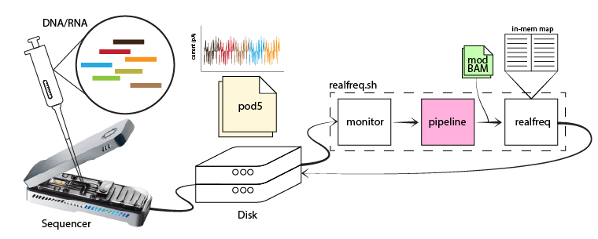
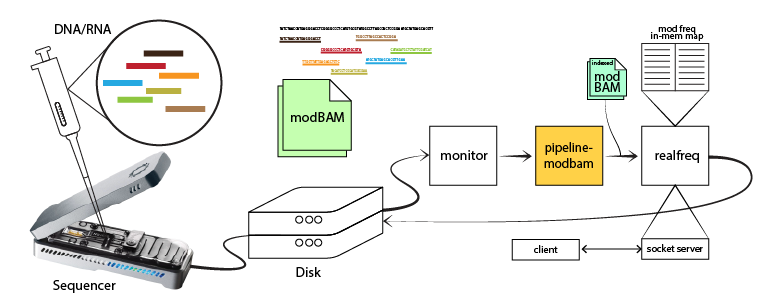
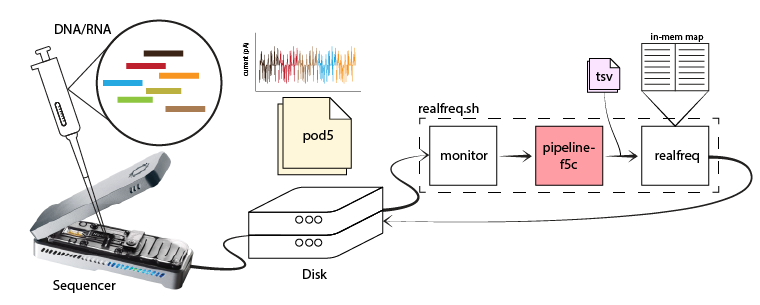

# <em>realfreq</em>
Real-time base modification frequency monitoring tool along with a real-time modification calling pipeline.



# Installation
## Building from source
```bash
git clone https://github.com/imsuneth/realfreq
cd realfreq
./scripts/install-hts.sh
make
```

Append parent directory where binary <em>realfreq</em> is in to PATH variable by appending following line to the <em>~/.bashrc</em> file.
```bash
export PATH=$PATH:/parent/dir/of/realfreq
```
Make sure to run ```source ~/.bashrc``` in order to use <em>realfreq</em> on already opened terminals.

# Usages
## Running <em>realfreq.sh</em> pipeline on a experiment directory
### Prerequisits
Following tools should be installed and available as they are used inside the pipeline
- [blue-crab](https://github.com/Psy-Fer/blue-crab)
- [buttery-eel](https://github.com/Psy-Fer/buttery-eel)
- [samtools](https://www.htslib.org/download/)
- [minimap2](https://github.com/lh3/minimap2)

If prerequisits are availbale, execute the following command on a terminal.

### Example Commands
1. Monitor POD5 files, convert to modBAM using default pipeline and call modifications and get frequencies using realfreq.


```bash
export DORADO_BIN=/data2/suneth/tools/ont-dorado-server/bin
export REF=/data2/suneth/data/hg38noAlt.fa
export REFIDX=/genome/hg38noAlt.idx
export DORADO_MODEL="dna_r10.4.1_e8.2_400bps_5khz_modbases_5hmc_5mc_cg_hac.cfg"

./scripts/realfreq.sh -m /data/exp_id
```

2. When "Modified bases" and "Alignment" are turned ON in MinKNOW, monitor BAM files, call modifications and get frequencies using realfreq.


```bash
export REF=/data2/suneth/data/hg38noAlt.fa

./scripts/realfreq.sh -m /data/exp_id -a "bam" -s scripts/pipeline-modbam.sh
```

3. Monitor POD5 files, convert to modBAM and call modification using f5c custom pipeline and get frequencies using realfreq.


```bash
export DORADO_BIN=/data2/suneth/tools/ont-dorado-server/bin
export REF=/data2/suneth/data/hg38noAlt.fa
export REFIDX=/genome/hg38noAlt.idx
export DORADO_MODEL="dna_r10.4.1_e8.2_400bps_5khz_modbases_5hmc_5mc_cg_hac.cfg"

./scripts/realfreq.sh -m /data/exp_id -s scripts/pipeline-f5c.sh
```

### Command
```bash
./scripts/realfreq.sh -m [directory] -g [dorado_bin] -f [reference] -x [reference_index] -e [model] [options ...]
```
### OPTIONS
```bash
 OPTIONS
    -h, --help                                    Print help message
    -i, --info                                    Print script information
    -m [directory]                                The sequencing experiment directory to be monitored
    -o [output]                                   Output file for modification frequency [default: freq.tsv]
    -r                                            Resumes a previous live conversion
    -c [port]                                     Server port for realfreq
    -t [time]                                     Timeout in seconds [default: 21600]
    -p [processes]                                Maximum number of parallel conversion processes [default: 1]
    -a [extension]                                Watch for files with extension [default: pod5]
    -b                                            Output bedmethyl format

 ADVANCED/DEBUGGING OPTIONS

    -n                                            Specify non-realtime analysis
    -d [filename]                                 Specify custom location for the list of attempted files [default: monitor_dir/realfreq_attempted_list.log]
    -l [filename]                                 Specify custom log filename [default: monitor_dir/realfreq.log]
    -f [file]                                     Specify location for the list of files that failed to convert [default: monitor_dir/realfreq_failed_list.log]
    -s [file]                                     Specify custom script for handling conversion [default: script_location/pipeline.sh]
    -y, --yes                                     Say yes to 'Are you sure?' message in advance for overwriting
```
### Environment variable
- REALFREQ_THREADS: number of threads used for modification calling (default 1)
- REALFREQ_AUTO: make realfreq.sh terminate at the end of MinKNOW sequencing run
```bash
export REALFREQ_THREADS=8
export REALFREQ_AUTO=1
```

### Tips
- Number of threads used by each tool in "raw signal to modBAM" pipeline can be changed appropriately in scripts/realfreq/pipeline.sh
- <em>reference_index</em> can be generated from <em>reference.fasta</em> using samtools running the command below
```bash
samtools faidx <reference.fasta>
```

## Running <em>realfreq</em> alone
<em>realfreq</em> takes the input file path (modBAM files or nanopolish/f5c TSV output files) form stdin. Therefore, file path can be either piped to <em>realfreq</em> or a list of paths can be given in a file. Command for the two scenarios are as follows.

Example commands
```bash
# using pipe
echo /path/to/reads.bam | ./realfreq -r ref.fa -o freq.tsv
# input a list of bam files
./realfreq -r ref.fa -o freq.tsv < bams_list.txt
```

## <em>realfreq</em> server

<em>realfreq</em> server provides an interface to access the real-time modification frequency information using simple socket connections.

<em>realfreq.sh</em> pipeline and <em>realfreq</em> doesn't start it unless specified by setting -c \<port> or --server \<port> flag. The server supports several query commands.

Available query commands
```bash
help
    show this help message
get_contig:<contig>
    query by contig
get_range:<start_pos>:<end_pos>
    query data between start and end positions (both inclusive)
get_contig_range:<contig>:<start_pos>:<end_pos>
    query by contig and between start and end positions
get_contig_range_mod:<contig>:<start_pos>:<end_pos>:<mod_code>
    query by contig and between start and end positions and by mod code
```

Sample query commands
```bash
nc localhost 8080 <<< help
nc localhost 8080 <<< get_contig:chr1
nc localhost 8080 <<< get_range:1:100
nc localhost 8080 <<< get_contig_range:chr22:18850302:49514860
nc localhost 8080 <<< get_contig_range_mod:chr22:18850302:49514860:m
```

## <em>realfreq</em> output
### TSV
```
contig	start	end	strand	n_called	n_mod	freq	mod_code
chr22	20016337	20016337	+	5	0	0.000000	m
chr22	20016594	20016594	+	2	0	0.000000	m
chr22	20017045	20017045	+	1	0	0.000000	m
chr22	19970705	19970705	+	1	0	0.000000	m
chr22	19981716	19981716	+	1	1	1.000000	m
chr22	20020909	20020909	+	3	0	0.000000	m
chr22	19995719	19995719	+	4	2	0.500000	m
chr22	20017060	20017060	+	1	0	0.000000	m
chr22	19971259	19971259	+	1	1	1.000000	m
```
| Field    | Type | Definition    |
|----------|-------------|-------------|
| 1. contig | str | choromosome |
| 2. start | int | position (0-based) of the base |
| 3. end   | int | position (0-based) of the base |
| 4. strand | char | strand (+/-) of the read |
| 5. n_called | int | number of reads called for base modification |
| 6. n_mod | int | number of reads with base modification |
| 7. freq | float | n_mod/n_called ratio |
| 8. mod_code | char | base modification code as in [SAMtags: 1.7 Base modifications](https://github.com/samtools/hts-specs/blob/master/SAMtags.pdf) |

#### Bedmethyl
```
chr22	20016337	20016338	m	5	+	20016337	20016337	255,0,0	5	0.000000
chr22	20016594	20016595	m	2	+	20016594	20016594	255,0,0	2	0.000000
chr22	20017045	20017046	m	1	+	20017045	20017045	255,0,0	1	0.000000
chr22	19970705	19970706	m	1	+	19970705	19970705	255,0,0	1	0.000000
chr22	19981716	19981717	m	1	+	19981716	19981716	255,0,0	1	1.000000
chr22	20020909	20020910	m	3	+	20020909	20020909	255,0,0	3	0.000000
chr22	19995719	19995720	m	4	+	19995719	19995719	255,0,0	4	0.500000
chr22	20017060	20017061	m	1	+	20017060	20017060	255,0,0	1	0.000000
chr22	19971259	19971260	m	1	+	19971259	19971259	255,0,0	1	1.000000
chr22	19973437	19973438	m	1	+	19973437	19973437	255,0,0	1	1.000000
```
| Field    | Type | Definition    |
|----------|-------------|-------------|
| 1. contig | str | choromosome |
| 2. start | int | position (0-based) of the base |
| 3. end   | int | position (0-based) of the base |
| 4. mod_code | char | base modification code as in [SAMtags: 1.7 Base modifications](https://github.com/samtools/hts-specs/blob/master/SAMtags.pdf) |
| 5. n_mod | int | number of reads with base modification |
| 6. strand | char | strand (+/-) of the read |
| 7. start | int | = field 2 |
| 8. end   | int | = field 3 |
| 9. n_mod | int | = field 5 |
| 10. freq | float | n_mod/n_called ratio |
